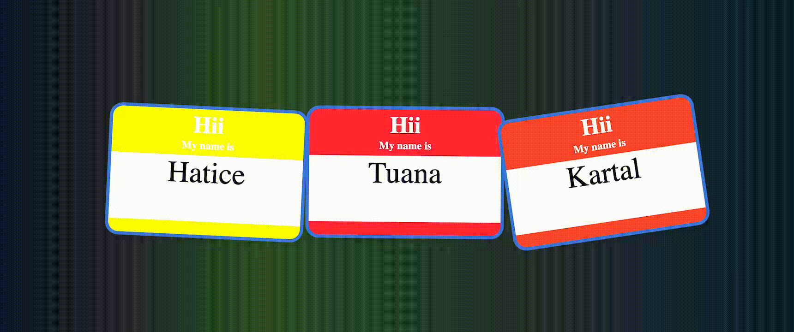

# Name Tag (Simple practical)
Bu proje, JavaScript kullanılarak geliştirilen, basit bir  ad etiketi (name tag)  uygulamasını içerir. 

# Kullanılan Teknolojiler
- HTML: Uygulamanın temel yapısı.

- CSS: Etiket ve sayfa tasarımı.

- JavaScript: Dinamik etiket oluşturma işlevselliği.

# GIF 

